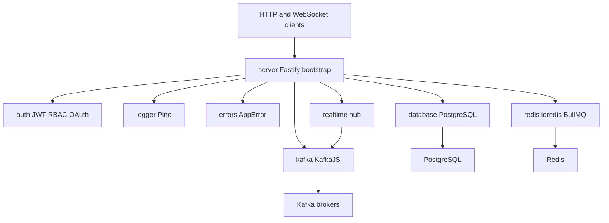
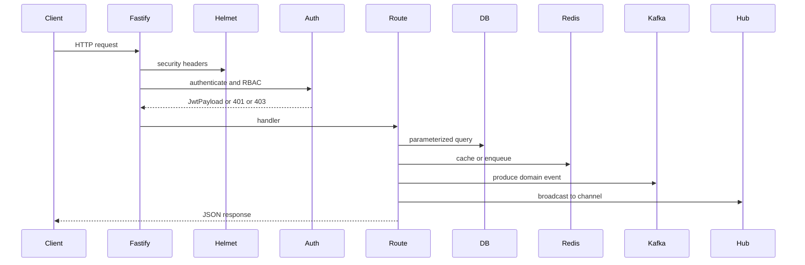

# Architecture

Bootstrap Framework is a pnpm workspace of independently published packages. There is no required runtime monolith. `@bootstrap-framework/server` is the optional composition root for Fastify services.

Repository: https://github.com/mayank040902/framework

## Workspace layout

```text
packages/
  server/      Fastify bootstrap, builtin plugins, health, hooks
  logger/      Pino logger, HTTP logger, serializers, transports
  errors/      AppError hierarchy, Result helpers, Fastify handler
  auth/        JWT, RBAC, scrypt passwords, OAuth adapters
  database/    PostgreSQL pool, transactions, models, migrations
  redis/       ioredis client, BullMQ queues and workers
  kafka/       KafkaJS client, SSL/SASL, codec adapters
  realtime/    WebSocket hub, transport adapter, Fastify plugin, backpressure, heartbeat, E2EE
examples/
  combined/    One service that wires every package
docs/          Architecture, security, guides
```

Each package has its own `package.json`, `LICENSE`, `README.md`, `CHANGELOG.md`, tests, and optional `examples/`. Published dependencies do not use the `workspace:` protocol.

Per-package internals are documented alongside the code. `packages/auth/ARCHITECTURE.md` covers the auth token lifecycle, refresh-store contract, and trust boundaries.

## Design principles

1. **Independent publish.** Install `@oneunit/kafka` in any Node.js app without Fastify.
2. **Optional peers.** Server plugins dynamically `import()` sibling packages. If a package is missing, the plugin logs a warning and disables itself.
3. **Adapters over coupling.** Kafka accepts logger, config, and codec adapters. Redis accepts any `{ error, warn, info, debug }` logger. Auth adapters cover Express, Fastify, Koa, and uWebSockets.js.
4. **Fail closed on secrets, fail open on extras.** Auth refuses to start without `secret`. Optional plugins (database, kafka, redis, realtime) skip when the package is not installed.
5. **Fail loudly on a missing capability.** `auth.refresh()` and `auth.logout()` throw `ConfigurationError` when the refresh store cannot invalidate a token, rather than reporting a logout that never happened.
6. **Treat caller-supplied identity as untrusted.** Auth derives token permissions from RBAC roles and ignores `roles` and `permissions` arriving from request input.
7. **Graceful shutdown.** Server, database pool, Kafka clients, Redis, and the realtime hub all close on `SIGINT` / `SIGTERM` when enabled.

## Package graph



Solid arrows are optional at runtime except `server` depending on Fastify.

## Composition root

`createBootstrapServer` / `startBootstrapServer` in `packages/server/src/bootstrap.ts`:

1. Load `.env` unless `env: false`
2. Resolve `PORT`, `HOST`, `SERVICE_NAME` via `serviceConfig`
3. Create Fastify with logger on (unless test)
4. Register lifecycle hooks
5. Register builtin plugins in a fixed order
6. Register `/health` unless `health: false`
7. Register `plugins` list and `extraPlugins`
8. Run `configure(server)`
9. Optionally listen and attach graceful shutdown

### Builtin plugin order

Zod type provider, then:

1. `@fastify/cors`
2. `@fastify/helmet`
3. `@fastify/cookie`
4. `@fastify/compress`
5. `@fastify/rate-limit`
6. logger plugin
7. database plugin
8. kafka plugin
9. redis plugin
10. realtime plugin
11. error handler plugin
12. msgpack content type

Defaults live in `DEFAULT_BUILTIN_PLUGINS`. Set a key to `false` to skip it.

## Request lifecycle



WebSocket clients join `RealtimeHub` channels. The realtime package holds no
broker client: an adapter in the application consumes from Kafka, Redis, or
NATS and calls `RealtimeHub.broadcast()`, which is the whole seam.

## Fastify decorations

When plugins load successfully:

| Decoration | Source |
| :--- | :--- |
| `server.db` / `server.database` | database plugin |
| `server.kafka` | kafka plugin |
| `server.redis` | redis plugin |
| `server.realtime` | realtime plugin |
| `server.auth` | `fastifyAdapter(auth)` |
| `server.authenticate()` | `fastifyAdapter(auth)` |
| `server.requirePermission(...)` | `fastifyAdapter(auth)` |
| `server.requireRole(...)` | `fastifyAdapter(auth)` |
| `request.user` | `fastifyAdapter(auth)` |

## Health

`GET /health` returns service name, system info, and optional checks. Any failed check yields HTTP 503.

```javascript
await startServer({
  health: {
    path: "/health",
    serviceName: "api",
    checks: async (server) => ({
      postgres: { status: Boolean(server.db) },
      redis: { status: Boolean(server.redis) },
    }),
  },
});
```

## Standalone vs composed

| Package | Standalone | Via server plugin |
| :--- | :--- | :--- |
| logger | `createLogger()` | `logger: true` |
| errors | `throw new NotFoundError()` | `errorHandler: true` |
| auth | `createAuth()` + adapters | `extraPlugins` + `fastifyAdapter` |
| database | `createDatabase()` | `database: true` |
| redis | `createClient()` | `redis: { url }` |
| kafka | `createKafkaClient()` | `kafka: { brokers }` |
| realtime | `createRealtimeHub()` | `realtime: { routes }` |

Use standalone factories in workers, scripts, and non-Fastify apps. Use server plugins when you want one process, shared logger, and `onClose` cleanup.

## Error model

`@bootstrap-framework/errors` is the HTTP/domain error layer. `@oneunit/auth` has its own `AuthError` hierarchy with `code` and `status`. Map auth errors in route handlers or let the Fastify adapter send `{ error, message }`.

Adapters report only their own failures. A Koa route's `next()` runs outside the authentication `try`, so a handler error reaches Koa's error handling instead of being rewritten as a 401.

Operational errors (`statusCode < 500`) are client faults. The Fastify handler omits `stack` unless `includeStack: true`.

## Data flow in the combined example

1. `POST /auth/register` hashes the password with scrypt, inserts a user row, returns tokens
2. `POST /auth/login` verifies the password, caches a session in Redis, produces `user.logged_in` to Kafka
3. Protected routes read `request.user` from the JWT
4. `POST /jobs/email` enqueues a BullMQ job
5. Kafka consumer (or worker process) handles domain events
6. `WS /ws/events` clients receive broadcasts when events occur

Registration assigns roles server-side, via `auth.register(input, { roles })`, so the request body cannot choose a role. Refresh tokens are persisted through a `refreshStore` whose `consume()` is atomic, so rotation holds under concurrent requests.
