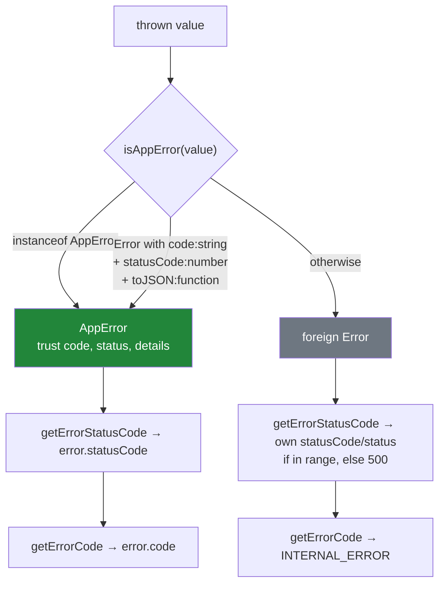
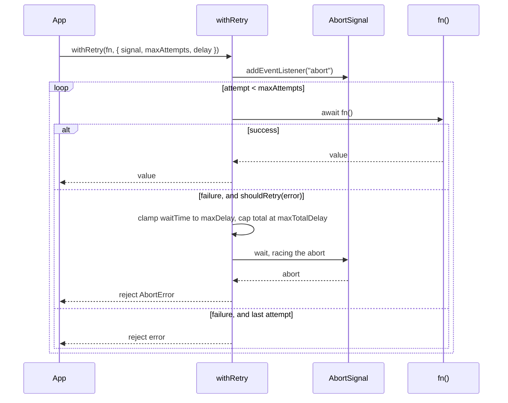
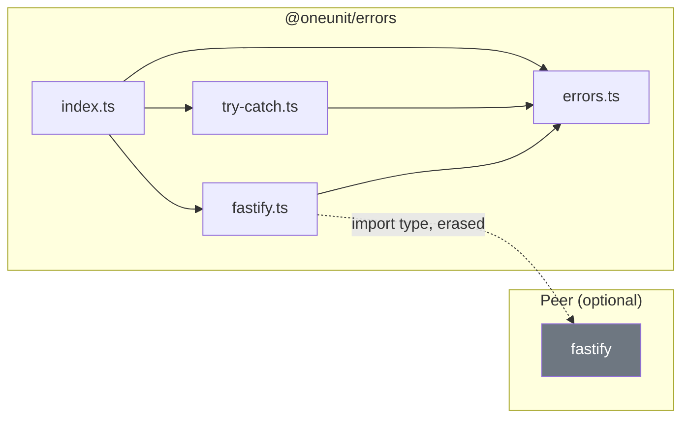

# Architecture

> Internal design reference for `@oneunit/errors`. For usage, see
> [README.md](README.md).

---

## Table of Contents

- [What this package is](#what-this-package-is)
- [Module layout](#module-layout)
- [The layering rule](#the-layering-rule)
- [Design principles](#design-principles)
- [Classifying a thrown value](#classifying-a-thrown-value)
- [The status ladder](#the-status-ladder)
- [One payload shape](#one-payload-shape)
- [Serialization across a boundary](#serialization-across-a-boundary)
- [Redaction is opt-in](#redaction-is-opt-in)
- [Cancellation and timers](#cancellation-and-timers)
- [Dependency graph](#dependency-graph)
- [Deliberate behaviors](#deliberate-behaviors)
- [Known limitations](#known-limitations)
- [Testing strategy](#testing-strategy)
- [Publishing checklist](#publishing-checklist)

---

## What this package is

`@oneunit/errors` has **zero runtime dependencies** and one optional peer,
`fastify`. It is a leaf in the monorepo graph: nothing else in `@oneunit`
imports it, and it imports nothing else. Everything it does is either a type, a
pure function over an `unknown`, or an adapter for Fastify.

That constraint shapes every design decision below. There is no configuration
to load, no connection to open, and no async work outside the retry and timeout
helpers. A package this widely depended upon cannot afford a failure mode of its
own, so the guiding rule is that **no function here may throw for a reason the
caller did not ask about** — with one deliberate exception, described below.

---

## Module layout

```text
src/
  index.ts       Public barrel — re-exports all three modules (75 exports).
  errors.ts      AppError and its 22 subclasses, guards, formatters,
                 cause traversal, redaction, (de)serialization.
  try-catch.ts   Result helpers, try/catch wrappers, withRetry, withTimeout.
  fastify.ts     createErrorHandler, createNotFoundHandler, registerErrorHandler,
                 errorHandlerPlugin, ERROR_CODES.
```

`index.ts` is two lines. Every module is independently importable through a
subpath export (`@oneunit/errors/errors`, `/try-catch`, `/fastify`) so a consumer
that only wants error classes does not pull the Fastify adapter into its
dependency graph — the adapter is the only part with a peer dependency.

The three modules are ordered by how little they need:

| Module | Runtime imports | Peer imports |
| :--- | :--- | :--- |
| `errors.ts` | none | none |
| `try-catch.ts` | `./errors.js` | none |
| `fastify.ts` | `./errors.js` | none (`import type` only) |

`fastify.ts` imports Fastify with `import type` and nothing else. Because
`verbatimModuleSyntax` is on, that import is erased entirely: the compiled
`dist/fastify.js` contains no `fastify` specifier, so importing the barrel in a
project with no Fastify installed works, and the optional peer stays honest.

---

## The layering rule

```text
   fastify.ts  ──▶  errors.ts
        │
        └─── (does not import try-catch.ts)

   try-catch.ts ──▶  errors.ts
```

`try-catch.ts` knows nothing about HTTP and `fastify.ts` knows nothing about
`Result`. `withRetry` decides what is retryable by calling `isRetryable` from
`errors.ts`, not by inspecting an HTTP status inline. If a future change needs
`fastify.ts` to reach for a retry helper, the dependency is drawn the wrong way
round: the shared rule belongs in `errors.ts`, which is the only module both can
depend on.

---

## Design principles

### 1. An error is a value, not an event

Every error here carries four things and nothing else: a `message`, a stable
machine-readable `code`, an HTTP `statusCode`, and an optional `details` record.
The `code` is the contract — it is what a caller branches on, it is what
`ERROR_CODES` enumerates, and it is what survives a network hop. `statusCode` is
derived from it, never the reverse.

### 2. The constructor is the validation boundary

`AppError` rejects a `statusCode` outside 100–599 with a `RangeError`:

```typescript
if (!Number.isInteger(statusCode) || statusCode < 100 || statusCode > 599) {
    throw new RangeError(...);
}
```

This is the one place the package throws unprompted, and it is deliberate. A
bad status does not fail here — it fails later, inside `reply.status()`, where
Fastify raises `FST_ERR_BAD_STATUS_CODE` on a request that has already been
matched, logged, and had its handler entered. The error surfaces at the point
where the stack trace is least useful. Validating at construction moves the
failure to the line that caused it.

### 3. Nothing throws while handling a failure

`tryCatch*`, `formatError`, `redactDetails`, `serializeError`, and
`deserializeError` must not throw, because they run in the path where the
program is already failing. A throwing `errorFactory` falls back to
`toAppError`; a cyclic `details` object becomes `"[Circular]"`; an
out-of-range serialized status becomes 500; a cause loop terminates at the first
repeat.

### 4. Canonical fields win over caller `details`

Constructor arguments are spread **before** the package's own fields:

```typescript
super(message, "VALIDATION_ERROR", 400, { ...details, fields });
```

so a caller passing `{ fields: something }` cannot make `details.fields`
disagree with `error.fields`. The spread used to be the other way round, which
made that disagreement trivially reachable.

### 5. Idempotence and no leaked timers

`withTimeout` clears its timer in a `finally`, so a fast promise does not hold
the event loop open for the rest of the timeout. Both `withTimeout` and
`withRetry` detach their `abort` listener on every exit path. Repeated aborts
are idempotent.

---

## Classifying a thrown value

Everything funnels through `isAppError`, which decides whether a value is one
of ours:



The structural fallback exists for the duplicated-install case: two copies of
this package in one dependency tree means `instanceof` fails, and a 404 silently
became a 500.

Requiring `toJSON` is what keeps that fallback from misfiring. Fastify's own
errors carry **both** `code: string` and `statusCode: number`; without the
`toJSON` requirement every one of them would be accepted as an `AppError` and
the whole status ladder below would be skipped.

---

## The status ladder

`createErrorHandler` maps an error to an `AppError` in a fixed order. The order
is load-bearing in three places:

```text
 1. isAppError            → the error already knows everything
 2. error.validation      → before any statusCode branch; a schema failure is
                            a 400 by definition and carries field paths
 3. 401 → AuthenticationError
 4. 403 → AuthorizationError
 5. 404 → NotFoundError("Resource", undefined, { path })
 6. 409 → ConflictError
 7. 413 → PayloadTooLargeError
 8. 415 → UnsupportedMediaTypeError
 9. 422 → UnprocessableError
10. 429 → RateLimitError
11. 503 → ServiceUnavailableError
12. 504 → TimeoutError
13. >= 500 → InternalError
14. >= 400 → AppError(code BAD_REQUEST, original statusCode)
15. else    → InternalError
```

Step 1 must precede everything, or a thrown `NotFoundError` would be re-wrapped
as a generic 404 and lose its resource. Step 2 must precede the status branches,
or Ajv's validation failure would be reported as a plain 400 with no field
paths.

**Step 14 preserves the incoming status.** It used to fall through to the same
`InternalError` as step 15, which meant a malformed JSON body, a 405, or a 418
all answered `500`. An unmapped 4xx is now answered with its own status and the
`BAD_REQUEST` code.

### Schema field paths

Ajv reports a missing property with an **empty** `instancePath` and the name
only in `params.missingProperty`. Keying on `instancePath || keyword` therefore
bucketed every missing field of a schema under one `"required"` key:

```text
{ "required": ["must have required property 'email'",
               "must have required property 'name'"] }     ← both fields lost
```

`validationFieldPath` joins the two, producing `/email` and `/name`.

---

## One payload shape

Every body this package emits is produced by `buildPayload`:

```typescript
{
  error: {
    name, message, code, statusCode,
    details,        // fields for ValidationError
    stack,          // omitted unless includeStack
    cause,          // only when includeCause
  },
  timestamp,
  path,
  requestId,
}
```

`formatValidationError` and `createErrorResponse` are both deprecated wrappers
around it. They previously each returned a **different** shape — one flattened
the error to the top level, the other omitted the envelope entirely — and
neither matched what the handler actually sent, so there were three answers to
"what does an error response look like". There is now one, and both functions
delegate.

---

## Serialization across a boundary

`JSON.stringify(error)` is lossy by design: it drops `cause`, drops the class,
and returns a plain object on the far side where `instanceof` fails. For a
package that ships `KafkaError` and `RedisError` — that is, one whose errors are
*expected* to cross a queue — that is a real problem, not a nicety.

`serializeError` emits a shape designed for the wire and `deserializeError`
reads it back:

```text
serializeError(new InternalError("query failed", cause, { attempt: 1 }))
  → { name, message, code, statusCode, details, cause: { name, message } }

deserializeError(that)
  → AppError with name "InternalError", code, statusCode, details, and cause
```

A code in `ERROR_REGISTRY` rebuilds the matching class. An unregistered code
becomes a plain `Error` that still carries `code`, `statusCode`, and `details`,
so a consumer that sees a new code from a newer producer still learns why it
failed. `stack` is omitted by default and `maxDepth` truncates a chain rather
than following it forever.

---

## Redaction is opt-in

`formatError(error, { redact })` and the Fastify `redactDetails` option mask
sensitive keys in `details`, using `DEFAULT_SENSITIVE_KEYS` when passed `true`.

**Default is off.** This is a deliberate compatibility choice, and it is a real
trade-off worth stating plainly: with redaction off, `JSON.stringify` of an
error whose `details` holds `{ password }` emits the password. Turning it on at
the `formatError` boundary would silently change the payload every existing
consumer parses.

The mitigation is layered rather than automatic. The HTTP path defaults
`includeStack: false` so stacks do not reach clients, and redaction is one option
away at both the formatter and the handler. `test/serialization.test.ts` asserts
both the on and off behaviour so the default cannot change unnoticed.

`redactDetails` clones along paths it changes and returns the original untouched
when nothing matched, so it never mutates caller-owned data. Cycles become
`"[Circular]"` and depth beyond 8 becomes `"[Object]"`.

---

## Cancellation and timers



Both helpers reject with **this package's** `AbortError`, never the platform
`DOMException`. `controller.abort()` produces a `DOMException` named
`"AbortError"`, which is not `instanceof`-compatible with an `Error` subclass of
the same name — so passing the reason through would give callers two different
types for one condition. The original reason is kept in `cause`.

Option values are clamped rather than trusted. `NaN` and `Infinity` on
`maxAttempts`, `delay`, or `backoff` no longer slip past the loop condition and
reject with `undefined`; `maxAttempts < 1` runs a single attempt rather than
none.

---

## Dependency graph



`dist/` contains no bare `fastify` specifier — the only occurrences of the string
are the `sourceMappingURL` comment and the internal `./errors.js` import. The CI
consumer smoke test asserts this rather than assuming it: it imports every
subpath in a clean project **before** installing the optional peer, and fails if
`fastify` turns out to be present, because the check would otherwise prove
nothing.

---

## Deliberate behaviors

These look like bugs and are not. See [CONTRIBUTING.md](./CONTRIBUTING.md#things-that-are-deliberate)
for the contributor-facing version.

- **`toJSON()` includes `stack`.** A bare `JSON.stringify(error)` therefore
  exposes file paths. The Fastify handler strips it; `serializeError` omits it
  unless asked. Removing it from `toJSON` would break the `includeStack` option
  and every consumer parsing the payload.
- **`formatError` defaults `includeStack: true`, the handler to `false`.** The
  formatter matches `toJSON`; the HTTP boundary is the one that has to be
  conservative.
- **`withRetry` runs at least one attempt** when `maxAttempts` is 0 or negative,
  rather than rejecting with `undefined`.
- **`deserializeError` rebuilds through the base class** and restores `name`.
  Constructor-shaped extras — `ValidationError.fields`, `KafkaError.topic` — are
  not restored as class properties; they survive inside `details`, which is what
  the wire format carries.
- **`combine` and `tryAll` do not fail fast.** Every input is settled before the
  result is returned, so the returned error is the first failure in argument
  order, not the first to occur.
- **`errorHandlerPlugin` sets `Symbol.for("skip-override")` by hand** instead of
  depending on `fastify-plugin`. Fastify core honours that symbol itself
  (`lib/plugin-utils.js`), so the wrapper would be a dependency doing nothing.
  Note the scope it does *not* give you: registering the plugin inside a nested
  `app.register(async (child) => …)` still scopes the handler to `child`.
- **`unwrap(err(x))` throws `x`,** which may be a non-`Error`. `Result<E>` does
  not constrain `E` to `Error`; a guard is the caller's job.

---

## Known limitations

Stated so nobody discovers them in production.

- **`withTimeout` does not cancel the underlying work.** It stops waiting. The
  operation needs its own `AbortSignal`.
- **Cyclic `cause` chains lose their tail.** Traversal stops at the first
  repeated error rather than guessing.
- **Redaction is key-name based.** A secret in a value — a raw SQL string in
  `DatabaseError.query`, a full connection URL in `details` — is not masked.
  Only matching key names are.
- **Redaction walks plain data only.** Class instances are passed by reference,
  matching the sibling `@oneunit/logger` walker's behavior and its cost
  rationale.
- **`ERROR_CODES` and `ERROR_REGISTRY` are two lists.** A test asserts they hold
  the same codes, but a new class must be added to both.
- **`isAppError`'s structural fallback requires `toJSON`.** An `AppError` from a
  package that strips `toJSON` is not recognized.

---

## Testing strategy

- **Runner**: Vitest, with `app.inject()` for the Fastify handler — real routes,
  real serialization, no listening socket and no network.
- **Import path**: tests import `../src`, not `../dist`. That is the opposite of
  `@oneunit/redis`, whose tests exercise the build. It means a green suite here
  does **not** prove the compiled output loads; the CI consumer smoke test
  installs the real tarball and does.

| Test file | Tests | Covers |
| :--- | ---: | :--- |
| `errors.test.ts` | 116 | The 22-class matrix (code, status, name, registry, `ERROR_CODES`), guards, `formatError` |
| `try-catch.test.ts` | 43 | `tryCatch*`, `Result` algebra, `toAppError` |
| `serialization.test.ts` | 26 | Round trips, cause chains, redaction, cycles, `maxDepth` |
| `fastify.test.ts` | 28 | The status ladder, 404, `Retry-After`, redaction, log levels, custom handlers |
| `resilience.test.ts` | 17 | Cancellation, budget caps, jitter, `Result` additions |

```bash
npm test                # 230 tests
npm run test:watch
npm run test:coverage   # thresholds in vitest.config.ts
npm run verify          # typecheck + lint + test
```

Coverage thresholds (statements 90, branches 85, functions 90, lines 90) are
enforced by the CI workflow, not by local convention. Current: **96.1% statements,
92.2% branches, 96.7% functions**.

---

## Publishing checklist

```bash
# 1. Everything passes
npm run verify && npm run build && npm run pack:check

# 2. Update CHANGELOG.md, then bump package.json

# 3. Commit, tag, publish
git commit -am "release(errors): vX.Y.Z"
git tag errors-vX.Y.Z
git push origin main --tags
```

CI refuses to publish a tag that does not match `package.json`'s version,
because npm will not let a version number be reused.